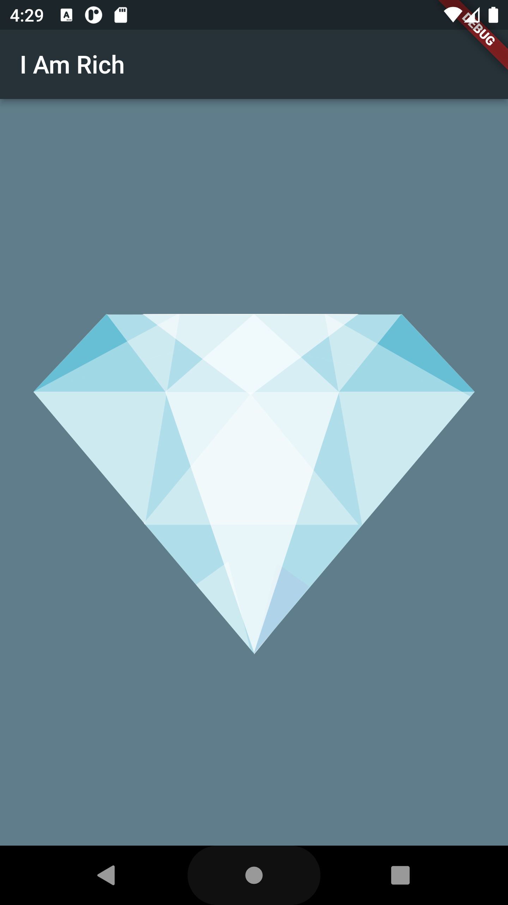

# My Journey to Learn Flutter

## Lesson 1: "I Am Rich" App

In this first lesson of my journey to learn Flutter, I created a simple app called "I Am Rich." This app served as an introduction to the basic concepts of Flutter and helped me gain an understanding of how to structure a Flutter application.

### What I Learned

- I learned how to set up a Flutter project and create a basic app structure.
- I explored the concept of widgets in Flutter and their role in building user interfaces.
- I used the `MaterialApp` widget to define a Material Design application.
- I implemented a basic UI layout using the `Scaffold` widget, which provided features like an app bar and a body.
- I customized the app bar title and background color using the `AppBar` widget and `backgroundColor` property.
- I used the `Center` widget to position UI elements in the center of the screen.
- I displayed an image using the `Image` widget and learned how to load an image from the asset folder.
- I gained insights into how the `runApp` function is used to start the Flutter app.

### Next Steps

This first lesson has provided me with a solid foundation in Flutter's fundamental concepts. As I continue on my journey, I plan to explore more complex widgets, understand state management, and create interactive user interfaces. I'm excited to build upon what I've learned and gradually develop more sophisticated Flutter applications.

Stay tuned for the next lesson as I delve deeper into Flutter development!

## Acknowledgments

I want to express my gratitude to the Flutter community for providing excellent resources and tutorials that helped me get started on this journey.
