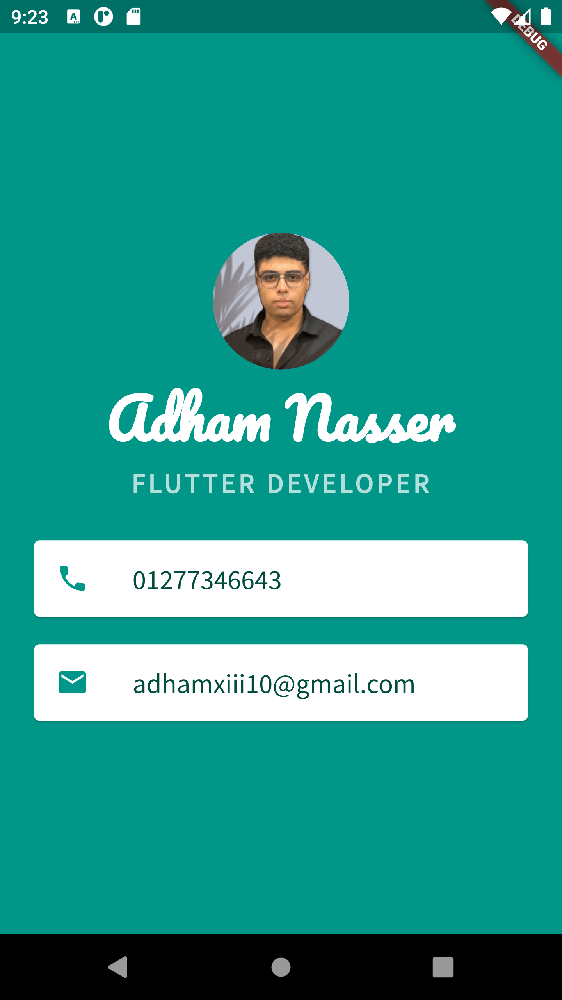

# Lesson 2: Creating a Personal Profile App

In this second lesson of my Flutter learning journey, I built a personal profile app that showcases my information using various Flutter widgets and layouts.

## What I Learned

- **StatelessWidget**: I created a `MyApp` class that extends `StatelessWidget`, which represents the core of the app's user interface.

- **Material Design**: I utilized the `MaterialApp` and `Scaffold` widgets to follow Material Design guidelines for the app's structure and layout.

- **SafeArea**: I wrapped the app's content in a `SafeArea` widget to ensure that it's displayed within the safe boundaries of the device.

- **Column Layout**: I organized the UI elements in a vertical layout using the `Column` widget, which allowed me to stack multiple widgets on top of each other.

- **CircleAvatar**: I used the `CircleAvatar` widget to display a circular profile picture with a background image.

- **Text Styling**: I customized the styling of text using the `TextStyle` class to set different fonts, sizes, colors, and font weights.

- **Divider**: I added a horizontal line using the `Divider` widget to separate different sections of the profile.

- **Card and ListTile**: I used `Card` widgets combined with `ListTile` widgets to display contact information in a visually appealing way.

- **Icon**: I included icons from the `Icons` class to represent phone and email contacts.

## Preview

## Next Steps

In the next lesson, I'll be diving deeper into Flutter development, exploring more advanced concepts, and enhancing the interactivity of my apps. Stay tuned for more exciting updates!

## Contact Information

If you have any questions or need assistance, you can reach out to the project author:

- Email: [Adham Nasser](mailto:adhamxiii22@gmail.com)
- LinkedIn: [Adham Nasser](https://www.linkedin.com/in/adhamxiii/)
- GitHub: [Adham Nasser](https://github.com/Adhamxiii)

I'd love to hear your thoughts and feedback!

